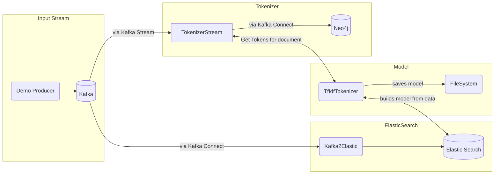

# YATA2
Yet another text analytics application

#### Dataflow

#### Description
This project is based on the idea, that a usually uncommon word can be way more common in the context of a specific domain.

To be specific: The results of the tfidf-algorithm backed by a generic corpus are compared with the results of a domain specific corpus (e.g. whisky reviews).
 
If a word is rather unusual in a normal corpus (e.g. Peat: tf-idf Score 0.185) but common in the domain specific corpus(e.g.Peat is a common description for whiskys: tf-idf score: 0.06) the chances are high, that the word is part of the vocabulary used in this specific field.
In comparison the word "Aglet" is not common in both the generic and in this case the domain specific corpus.

This method is used to determine the most important words for each document. Based on these words, relationships between documents are formed and persisted into a Neo4j Database.