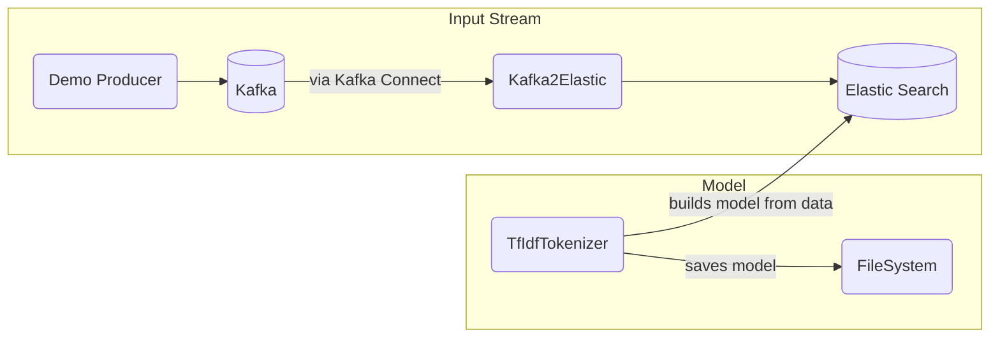

# YATA2
Yet another text analytics application

```mermaid
flowchart LR
subgraph Input Stream
direction LR
DP(Demo Producer) -->Kafka[(Kafka)]
Kafka -->|via Kafka Connect| K2E(Kafka2Elastic)
K2E--> Elastic[(Elastic Search)]
end
subgraph Model
direction BT
Tokenizer(TfIdfTokenizer) --> |builds model from data| Elastic
Tokenizer -->|saves model| FileSystem(FileSystem)
end
```
